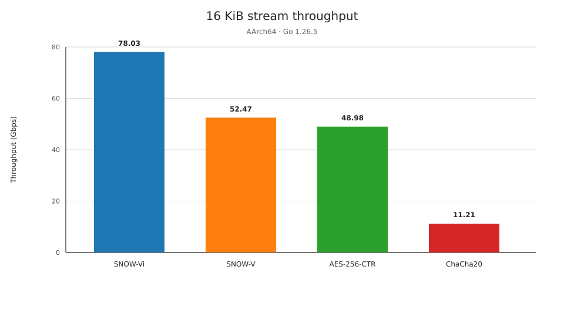

# snowfive

> A highly optimized Go implementation of the SNOW-V and SNOW-Vi synchronous stream ciphers.

## API

[GoDoc](https://pkg.go.dev/github.com/morpheme-im/snowfive)

```go
const KeySize = 32
const IVSize = 16

func NewSnowVCipher(key, iv []byte) (*SnowVCipher, error)
func (c *SnowVCipher) Rekey(key, iv []byte) error
func (c *SnowVCipher) XORKeyStream(dst, src []byte)
func (c *SnowVCipher) Destroy()

func NewSnowViCipher(key, iv []byte) (*SnowViCipher, error)
func (c *SnowViCipher) Rekey(key, iv []byte) error
func (c *SnowViCipher) XORKeyStream(dst, src []byte)
func (c *SnowViCipher) Destroy()
```

## Benchmark



| Algorithm | Gbps | vs AES-256-CTR |
| --- | ---: | ---: |
| SNOW-Vi | 78.03 | 1.59× |
| SNOW-V | 52.47 | 1.07× |
| AES-256-CTR | 48.98 | 1.00× |
| ChaCha20 | 11.21 | 0.23× |

## References

- Patrik Ekdahl, Thomas Johansson, Alexander Maximov, and Jing Yang,
  [“A new SNOW stream cipher called SNOW-V”](https://eprint.iacr.org/2018/1143),
  IACR ePrint 2018/1143, revision 2019-08-27.
- Patrik Ekdahl, Alexander Maximov, Thomas Johansson, and Jing Yang,
  [“SNOW-Vi: An Extreme Performance Variant of SNOW-V for Lower Grade CPUs”](https://doi.org/10.1145/3448300.3467829),
  DOI `10.1145/3448300.3467829`.
